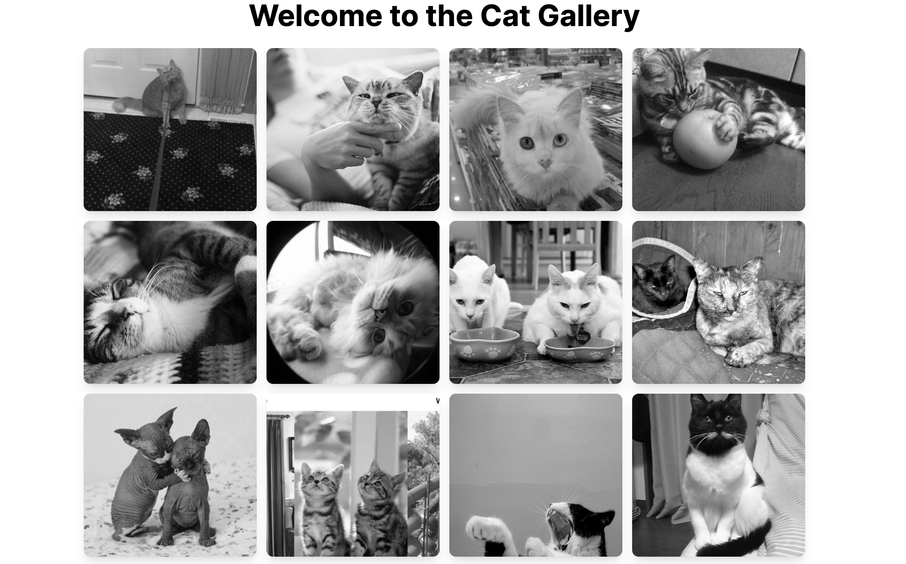

# Cat Gallery

Welcome to **Cat Gallery** - a simple and beautiful gallery application showcasing various cat images. This project is built using Next.js, TypeScript, and Tailwind CSS. This repository is intended for a workshop focused on deploying client-side applications.



## Table of Contents

- [Features](#features)
- [Getting Started](#getting-started)
  - [Prerequisites](#prerequisites)
  - [Installation](#installation)
  - [Running the Project](#running-the-project)
- [Deployment](#deployment)
- [Technologies Used](#technologies-used)

## Features

- Display a beautiful gallery of cat images.
- TypeScript for type safety and improved developer experience.

## Getting Started

### Prerequisites

Ensure you have the following installed on your machine:

- Node.js (>= 18.17)
- npm or yarn

### Installation

Clone the repository:

git clone https://github.com/khanz1/cats-gallery.git
cd cat-gallery

Install the dependencies:

Using npm:

```
npm install
```

Or using yarn:

```
yarn install
```

### Running the Project

Start the development server:

Using npm:

```
npm run dev
```

Or using yarn:

```
yarn dev
```

Open your browser and navigate to `http://localhost:5173`.

## Deployment

This project will be deployed on [Jagoan Hosting](https://www.jagoanhosting.com/)

For deployment instructions, follow these steps:

```
step to deploy
```

## Technologies Used

- **Next.js**: A React framework for server-side rendering and static site generation.
- **TypeScript**: A superset of JavaScript that adds static types.
- **Tailwind CSS**: A utility-first CSS framework for rapid UI development.
