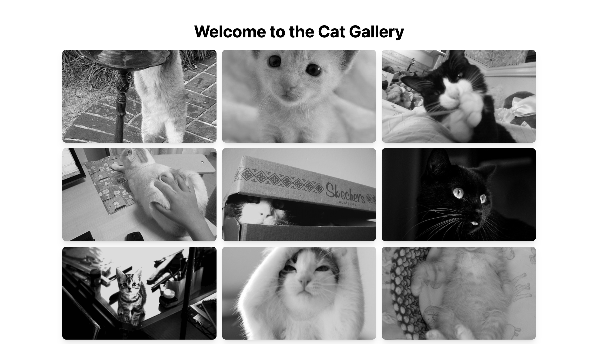

# Cat Gallery

Welcome to **Cat Gallery** - a simple and beautiful gallery application showcasing various cat images. This project is built using React and Tailwind CSS.



## Table of Contents

- [Cat Gallery](#cat-gallery)
  - [Table of Contents](#table-of-contents)
  - [Features](#features)
  - [Getting Started](#getting-started)
    - [Prerequisites](#prerequisites)
    - [Installation](#installation)
    - [Running the Project](#running-the-project)
  - [Deployment](#deployment)
  - [Technologies Used](#technologies-used)

## Features

- Display a beautiful gallery of cat images.

## Getting Started

### Prerequisites

Ensure you have the following installed on your machine:

- Node.js latest LTS version
- npm

### Installation

Clone the repository:

```bash
git clone https://github.com/khanz1/cats-gallery.git
cd cat-gallery
```

Install the dependencies:

```bash
npm install
```

### Running the Project

Start the development server:

```bash
npm run dev
```

Open your browser and navigate to `http://localhost:5173`.

## Deployment

This project will be deployed on [Jagoan Hosting](https://www.jagoanhosting.com/)

For deployment instructions, follow these steps:

```
step to deploy
```

## Technologies Used

- **Vite**: Next Generation Frontend Tooling
- **React**: The library for web and native user interfaces.
- **Tailwind CSS**: A utility-first CSS framework for rapid UI development.
